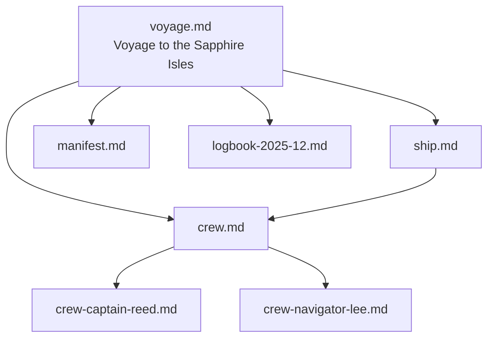

# The Windchaser Project

One voyage. One ship. Twenty souls.  
Everything below is a single Markdown file with Yurtle front matter.

```mermaid
graph TD
    V[voyage.md<br/>Voyage to the Sapphire Isles] --> S[ship.md]
    V --> C[crew.md]
    V --> M[manifest.md]
    V --> L[logbook-2025-12.md]
    S --> C
    C --> CR[crew-captain-reed.md]
    C --> NL[crew-navigator-lee.md]
```

